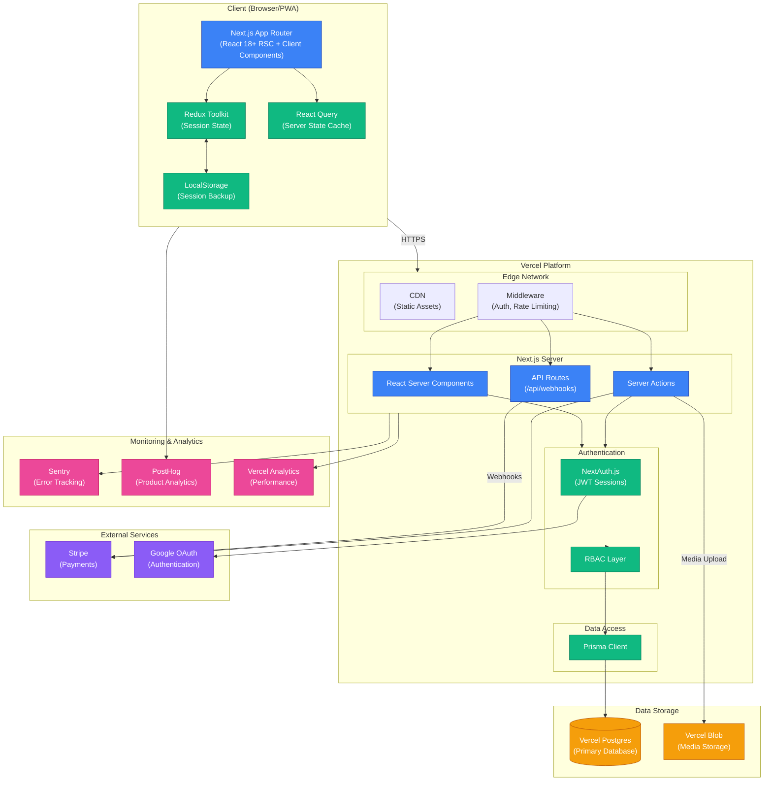
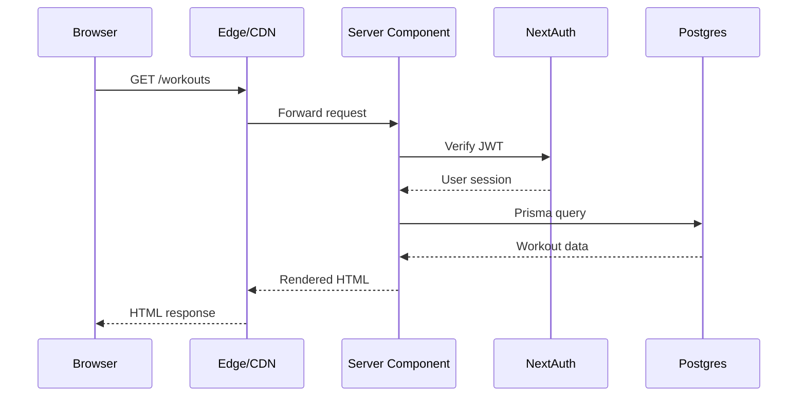
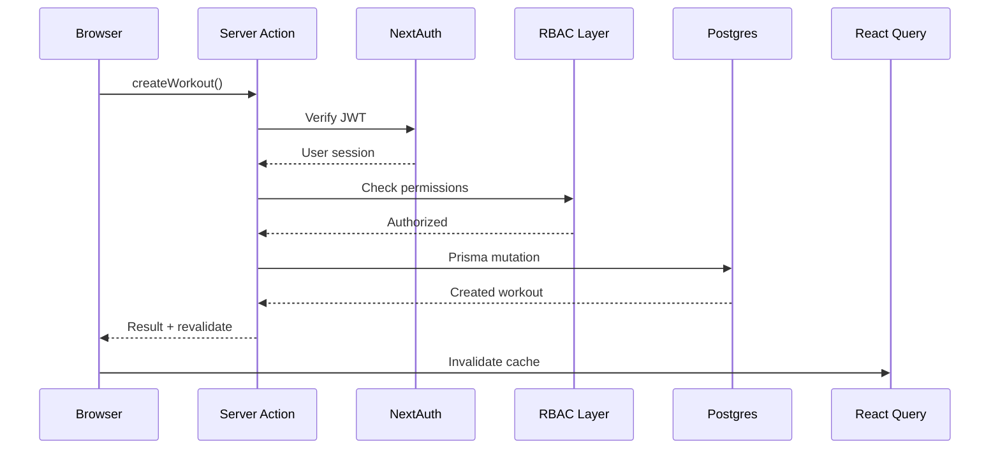
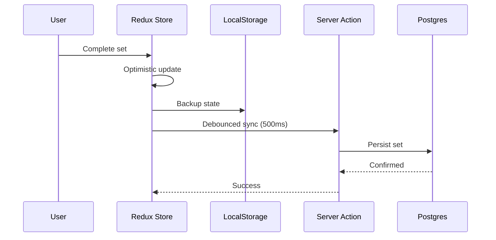
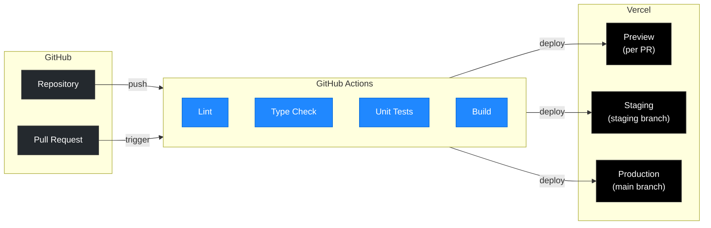
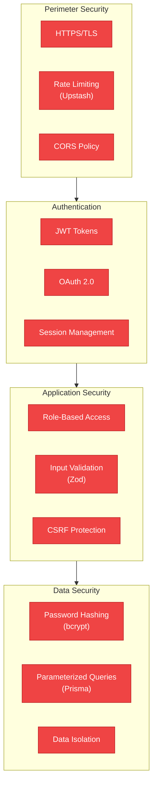

# B-Fit System Architecture

## Overview

This document provides a high-level overview of the B-Fit system architecture, showing the relationships between all major components including the frontend, backend services, database, and external integrations.

## System Architecture Diagram

## Component Descriptions

### Client Layer

| Component | Technology | Purpose |
|-----------|------------|---------|
| UI Pages | Next.js App Router | Renders pages using React Server Components and Client Components |
| Redux Store | Redux Toolkit | Manages client-side session state during live workouts |
| React Query | TanStack Query | Caches server data, handles async state, automatic refetching |
| LocalStorage | Browser API | Persists session state for recovery on page refresh |

### Vercel Platform

| Component | Technology | Purpose |
|-----------|------------|---------|
| CDN | Vercel Edge | Serves static assets (JS, CSS, images) globally |
| Middleware | Next.js Middleware | Authentication checks, rate limiting, route protection |
| Server Components | React 18 RSC | Server-rendered components, no client JS for static content |
| Server Actions | Next.js Server Actions | Type-safe API layer for mutations and data fetching |
| API Routes | Next.js Route Handlers | Webhook endpoints for Stripe |
| NextAuth | NextAuth.js v5 | JWT-based authentication with OAuth providers |
| RBAC | Custom Middleware | Role-based access control for all operations |
| Prisma | Prisma ORM | Type-safe database queries, migrations, schema management |

### Data Storage

| Component | Service | Purpose |
|-----------|---------|---------|
| Database | Vercel Postgres | Primary relational database for all application data |
| Media Storage | Vercel Blob | Stores user-uploaded media (profile images, check-in photos) |

### External Services

| Service | Purpose | Integration |
|---------|---------|-------------|
| Stripe | Payment processing | Checkout sessions, subscriptions, webhooks |
| Google OAuth | Social authentication | NextAuth.js provider |

### Monitoring

| Service | Purpose | Coverage |
|---------|---------|----------|
| Sentry | Error tracking | Server and client errors with context |
| PostHog | Product analytics | User behavior, feature usage, funnels |
| Vercel Analytics | Performance | Core Web Vitals, latency metrics |

## Data Flow Patterns

### 1. Read Operations (Server Components)

### 2. Write Operations (Server Actions)

### 3. Live Session State Sync

## Deployment Architecture

## Security Layers

---

**Document Version**: 1.0
**Last Updated**: 2026-01-26
