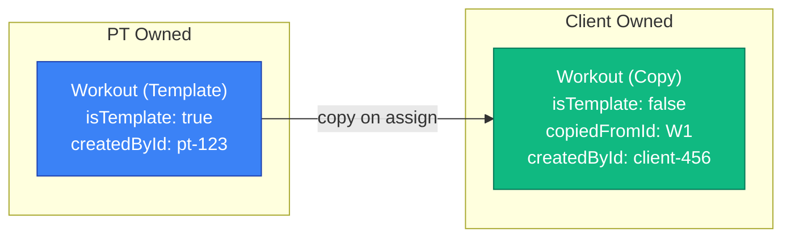
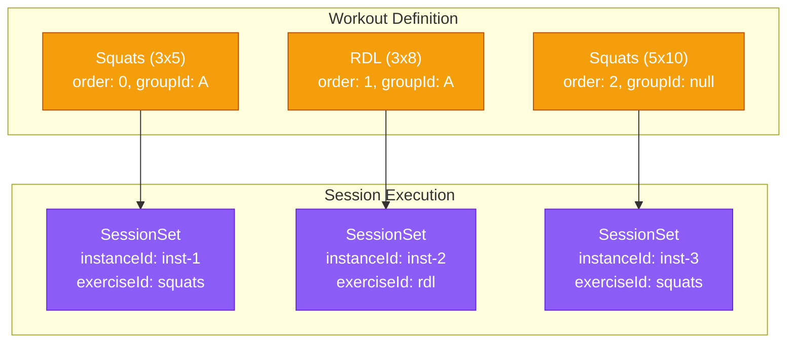
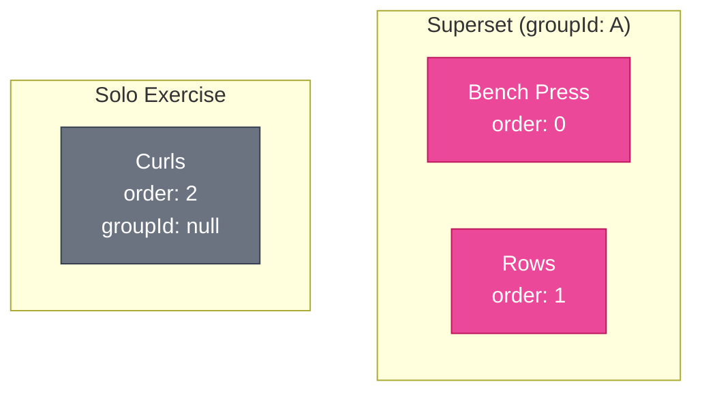

# B-Fit Data Model

## Overview

This document presents the complete entity relationship diagram for the B-Fit application, showing all database tables, their relationships, and key fields with cardinalities.

## Entity Relationship Diagram

```mermaid
erDiagram
    %% ==================
    %% USER & AUTH
    %% ==================

    User ||--o{ Account : "has"
    User ||--o{ Session : "has"
    User ||--|| Subscription : "has"
    User ||--o| BrandingSettings : "has (PT only)"
    User }o--o| Organisation : "belongs to (PT)"

    User ||--o{ Exercise : "creates"
    User ||--o{ Workout : "creates"
    User ||--o{ TrainingSession : "performs"
    User ||--o{ Plan : "creates"
    User ||--o{ ExerciseHistory : "has"

    User ||--o{ ClientRelationship : "as PT"
    User ||--o{ ClientRelationship : "as Client"
    User ||--o{ Message : "sends"
    User ||--o{ Message : "receives"

    User {
        string id PK
        string email UK
        datetime emailVerified
        string name
        string password
        string image
        UserRole role
        boolean isActive
        string stripeCustomerId
        string subscriptionTier
        int clientCapacity
        string organisationId FK
        datetime createdAt
        datetime updatedAt
    }

    Account {
        string id PK
        string userId FK
        string type
        string provider
        string providerAccountId
        string refresh_token
        string access_token
        int expires_at
        string token_type
        string scope
        string id_token
    }

    Session {
        string id PK
        string sessionToken UK
        string userId FK
        datetime expires
    }

    VerificationToken {
        string identifier
        string token UK
        datetime expires
    }

    %% ==================
    %% EXERCISES
    %% ==================

    Exercise ||--o{ WorkoutExercise : "used in"
    Exercise ||--o{ SessionSet : "tracked in"
    Exercise ||--o{ ExerciseHistory : "has history"

    Exercise {
        string id PK
        string name
        string description
        MuscleGroup primaryMuscleGroup
        MuscleGroup[] secondaryMuscleGroups
        EquipmentType equipmentType
        MovementPattern movementPattern
        DifficultyLevel difficultyLevel
        ExerciseType exerciseType
        MetricType metricType
        json instructions
        boolean isDefault
        boolean isPublic
        string createdById FK
        datetime createdAt
        datetime updatedAt
    }

    ExerciseHistory {
        string id PK
        string userId FK
        string exerciseId FK
        json personalRecords
        json volumeHistory
        datetime lastPerformed
        datetime createdAt
        datetime updatedAt
    }

    %% ==================
    %% WORKOUTS
    %% ==================

    Workout ||--o{ WorkoutExercise : "contains"
    Workout ||--o{ TrainingSession : "executed as"
    Workout ||--o{ PlanWorkout : "scheduled in"
    Workout ||--o{ Message : "discussed in"
    Workout }o--o| Workout : "copied from"

    Workout {
        string id PK
        string name
        string description
        string createdById FK
        boolean isTemplate
        string copiedFromId FK
        datetime createdAt
        datetime updatedAt
    }

    WorkoutExercise {
        string id PK
        string workoutId FK
        string exerciseId FK
        int order
        string groupId
        int sets
        int reps
        float weight
        int restSeconds
        string notes
        datetime createdAt
        datetime updatedAt
    }

    %% ==================
    %% TRAINING SESSIONS
    %% ==================

    TrainingSession ||--o{ SessionSet : "contains"
    TrainingSession ||--o{ Message : "discussed in"

    TrainingSession {
        string id PK
        string workoutId FK
        string userId FK
        SessionStatus status
        datetime startedAt
        datetime completedAt
        json localStorageBackup
        int currentExerciseIndex
        json currentSetIndices
        float totalVolume
        int duration
        datetime createdAt
        datetime updatedAt
    }

    SessionSet {
        string id PK
        string sessionId FK
        string exerciseId FK
        string instanceId
        int setNumber
        int reps
        float weight
        int duration
        float distance
        datetime completedAt
        string notes
        datetime createdAt
        datetime updatedAt
    }

    %% ==================
    %% PLANS
    %% ==================

    Plan ||--o{ PlanWorkout : "contains"
    Plan ||--o{ Message : "discussed in"

    Plan {
        string id PK
        string name
        string description
        int durationWeeks
        int daysPerWeek
        boolean isActive
        datetime activatedAt
        string createdById FK
        datetime createdAt
        datetime updatedAt
    }

    PlanWorkout {
        string id PK
        string planId FK
        string workoutId FK
        int dayNumber
        string notes
        datetime createdAt
    }

    %% ==================
    %% CLIENT RELATIONSHIPS
    %% ==================

    ClientRelationship {
        string id PK
        string ptId FK
        string clientId FK
        ClientRelationshipStatus status
        datetime startedAt
        datetime endedAt
        datetime invitedAt
        datetime acceptedAt
        datetime createdAt
        datetime updatedAt
    }

    %% ==================
    %% SUBSCRIPTIONS
    %% ==================

    Subscription {
        string id PK
        string userId FK UK
        string stripeSubscriptionId UK
        string stripePriceId
        datetime stripeCurrentPeriodEnd
        SubscriptionStatus status
        boolean cancelAtPeriodEnd
        datetime canceledAt
        datetime createdAt
        datetime updatedAt
    }

    %% ==================
    %% MESSAGING
    %% ==================

    Message {
        string id PK
        string senderId FK
        string recipientId FK
        string workoutId FK
        string sessionId FK
        string planId FK
        string content
        string mediaUrl
        datetime readAt
        datetime createdAt
    }

    %% ==================
    %% ORGANISATION
    %% ==================

    Organisation ||--o| OrganisationBranding : "has"

    Organisation {
        string id PK
        string name
        string stripeCustomerId
        string subscriptionTier
        int ptCapacity
        int clientCapacity
        datetime createdAt
        datetime updatedAt
    }

    OrganisationBranding {
        string id PK
        string organisationId FK UK
        string logoUrl
        string primaryColor
        string accentColor
        datetime createdAt
        datetime updatedAt
    }

    BrandingSettings {
        string id PK
        string ptId FK UK
        string logoUrl
        string primaryColor
        string accentColor
        datetime createdAt
        datetime updatedAt
    }
```

## Key Design Patterns

### 1. Workout Copy-on-Assign Pattern

When a PT assigns a workout to a client, a copy is created:



### 2. Session Instance Tracking Pattern

Same exercise appearing multiple times uses unique instanceId:



### 3. Superset Grouping Pattern

Exercises with same groupId form a superset:



---

**Document Version**: 1.0
**Last Updated**: 2026-01-26
