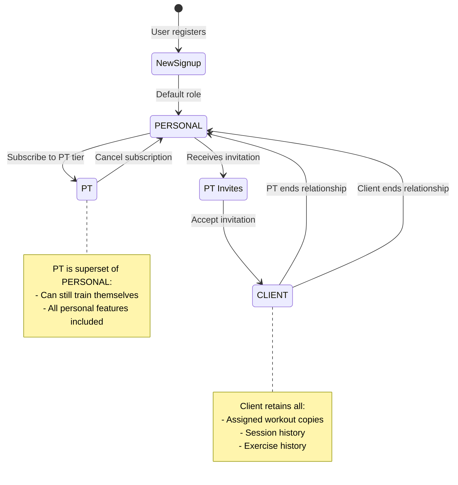
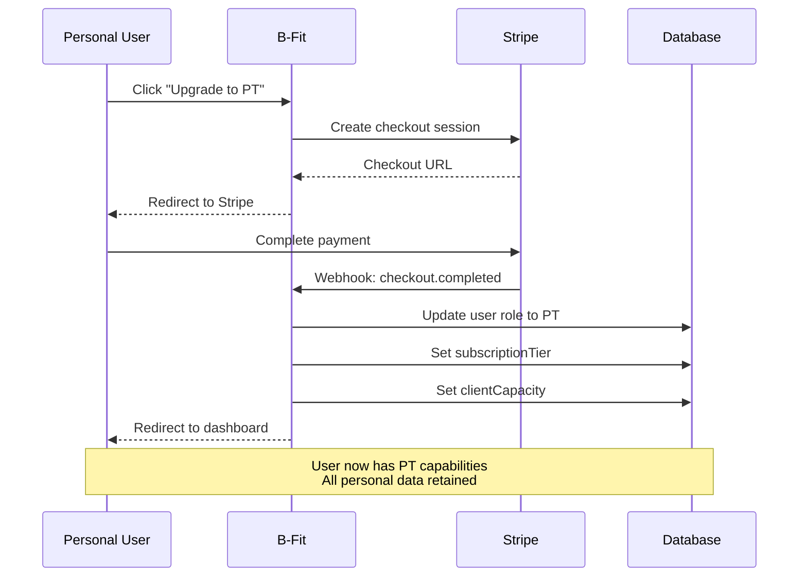
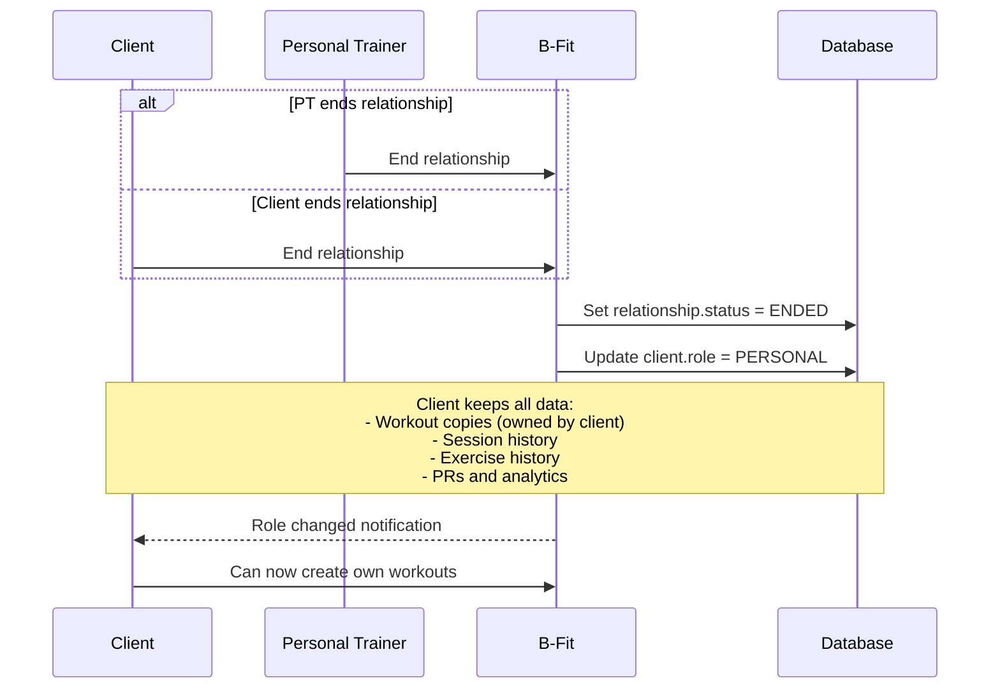
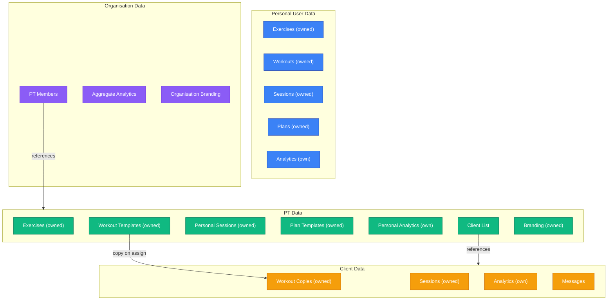

# B-Fit User Role Hierarchy

## Overview

This document describes the four user roles in B-Fit, their permission hierarchy, inheritance patterns, and role transition flows.

## Role Hierarchy Diagram

```mermaid
flowchart TB
    subgraph Roles["User Roles"]
        direction TB

        ORG["Organisation Admin<br/>(ORG)"]
        PT["Personal Trainer<br/>(PT)"]
        PERSONAL["Personal User<br/>(PERSONAL)"]
        CLIENT["Client<br/>(CLIENT)"]
    end

    subgraph Capabilities["Capability Inheritance"]
        direction TB

        C_ORG["Org Capabilities<br/>- Manage PT seats<br/>- Aggregate analytics<br/>- Organisation branding"]
        C_PT["PT Capabilities<br/>- Manage clients<br/>- Assign workouts/plans<br/>- View client data<br/>- PT branding<br/>- Messaging"]
        C_PERSONAL["Personal Capabilities<br/>- Create exercises<br/>- Create workouts<br/>- Create plans<br/>- Personal analytics<br/>- Session tracking"]
        C_CLIENT["Client Capabilities<br/>- View assigned workouts<br/>- Execute sessions<br/>- Personal analytics<br/>- Message PT"]
    end

    ORG --> C_ORG
    PT --> C_PT
    PT --> C_PERSONAL
    PERSONAL --> C_PERSONAL
    CLIENT --> C_CLIENT

    C_ORG -.->|"oversees"| C_PT
    C_PT -.->|"superset of"| C_PERSONAL

    classDef role fill:#3B82F6,stroke:#1E40AF,color:#fff
    classDef cap fill:#10B981,stroke:#047857,color:#fff

    class ORG,PT,PERSONAL,CLIENT role
    class C_ORG,C_PT,C_PERSONAL,C_CLIENT cap
```

## Role Transitions

## Transition: Personal to PT

## Transition: Client to Personal

## Data Ownership by Role

---

**Document Version**: 1.0
**Last Updated**: 2026-01-26
