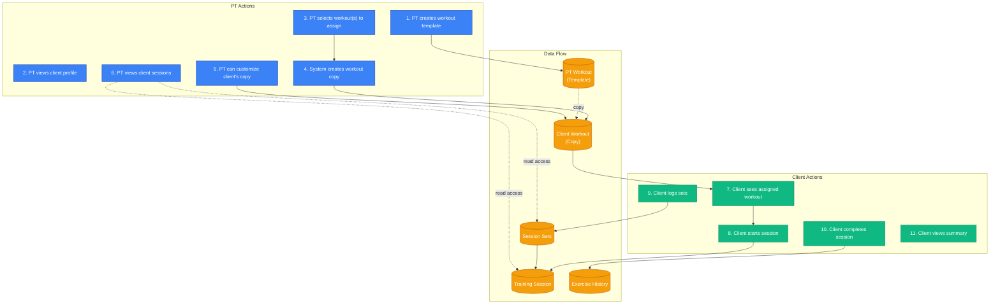
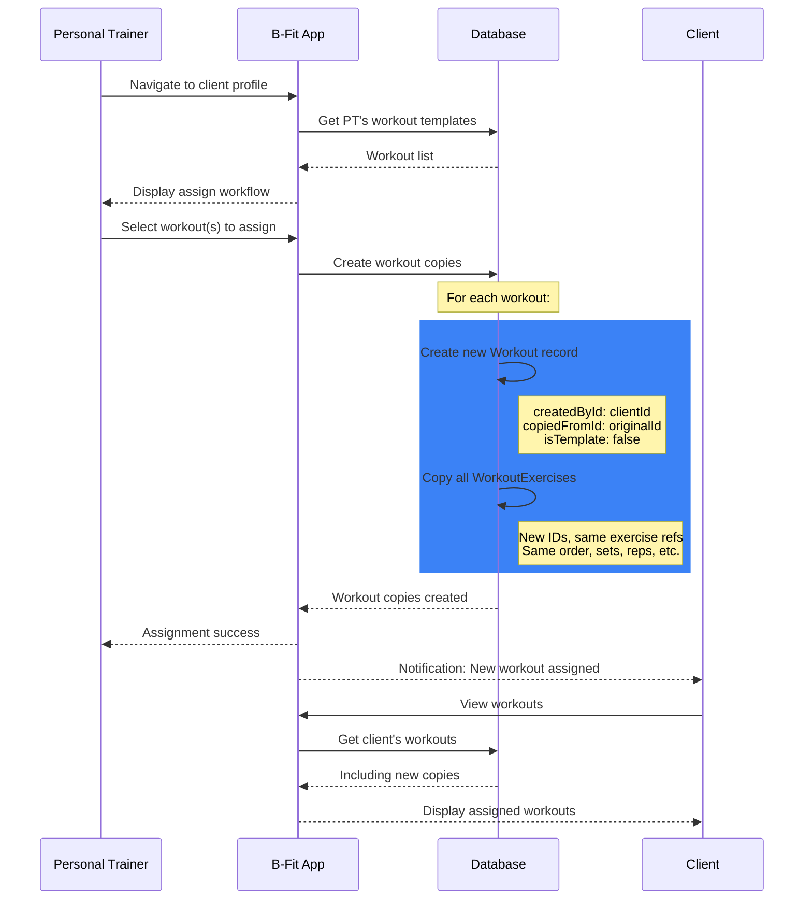
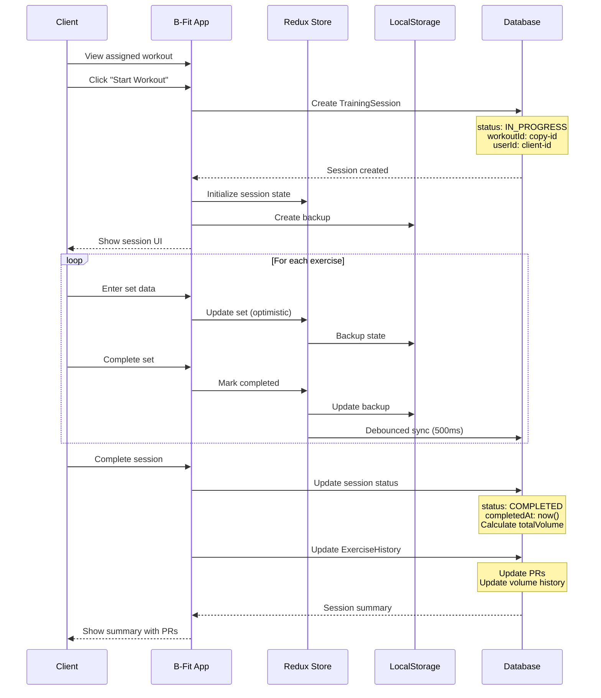
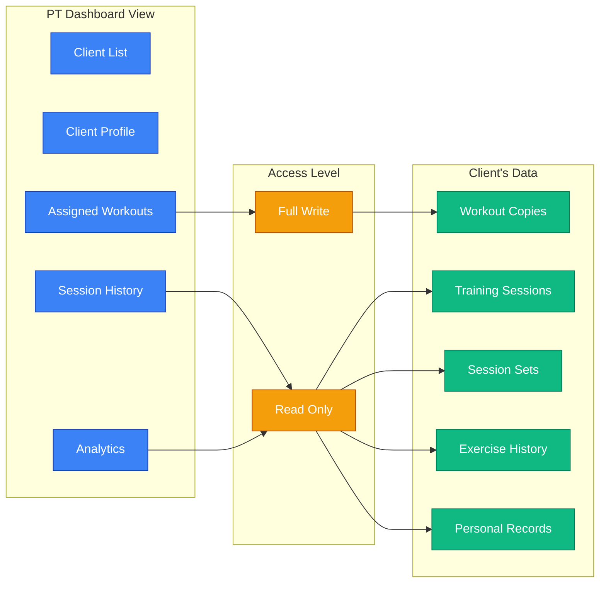

# B-Fit Workout Assignment Flow

## Overview

This document illustrates the complete flow of workout assignment from PT to Client, including the copy-on-assign pattern, workout customization, session execution, and data visibility.

## End-to-End Workflow

## Copy-on-Assign Pattern

## Client Session Execution

## PT Visibility of Client Data

---

**Document Version**: 1.0
**Last Updated**: 2026-01-26
