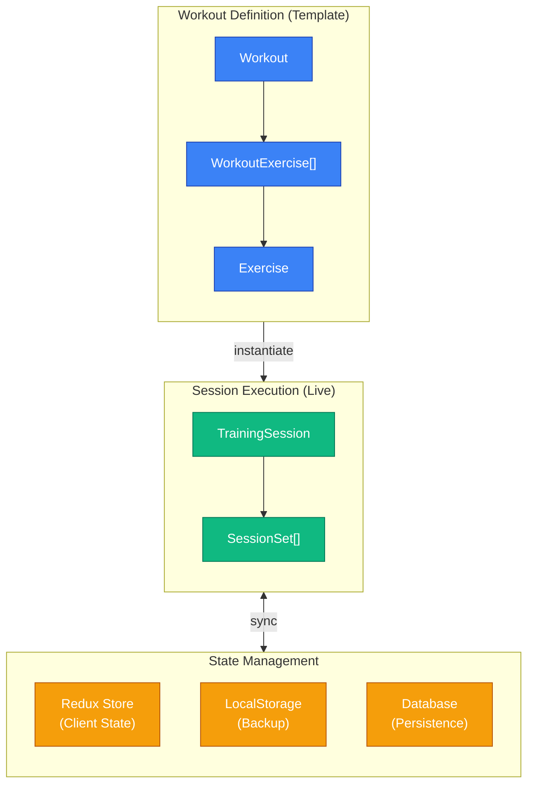
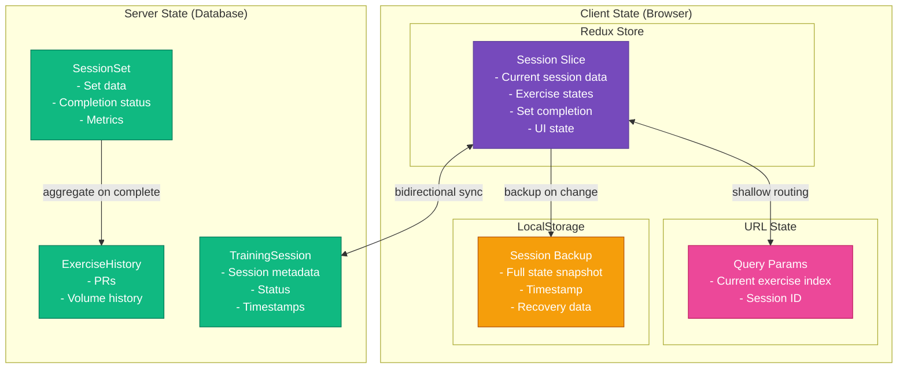
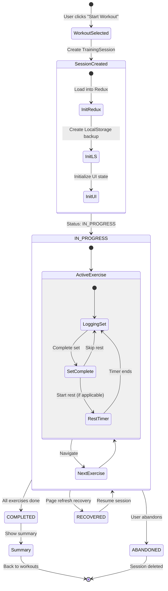
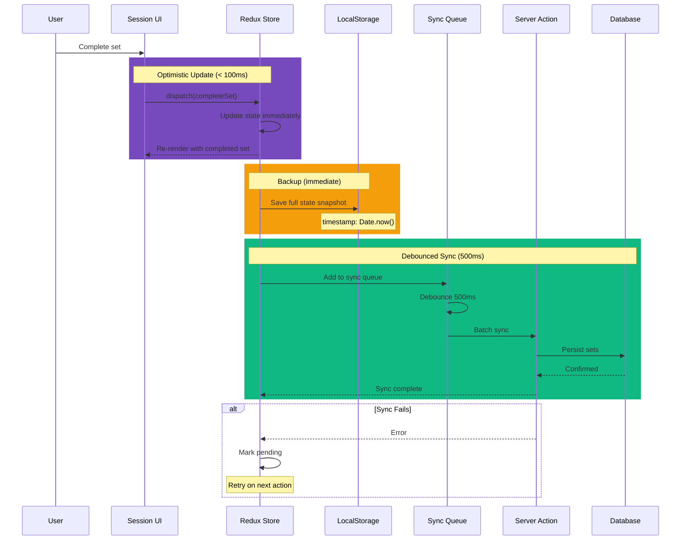
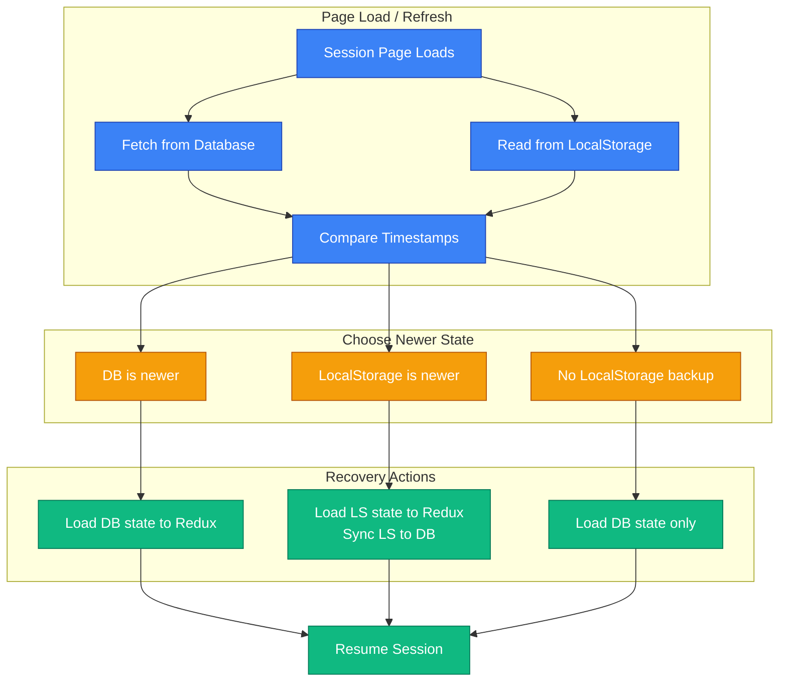

# B-Fit Session State Management

## Overview

This document details the session state management architecture, including the separation between workout definitions and session execution, real-time state updates, persistence strategies, and recovery mechanisms.

## Conceptual Model

## State Architecture

## Session Lifecycle

## Real-Time Update Flow

## Recovery on Page Refresh

## Performance Requirements

| Metric                   | Target  | Implementation           |
| ------------------------ | ------- | ------------------------ |
| Set completion UI update | < 100ms | Optimistic Redux update  |
| LocalStorage backup      | < 50ms  | Synchronous write        |
| Database sync            | < 500ms | Debounced batch          |
| Session recovery         | < 1s    | Parallel fetch + compare |
| Memory usage             | < 10MB  | Minimal state shape      |

---

**Document Version**: 1.0
**Last Updated**: 2026-01-26
