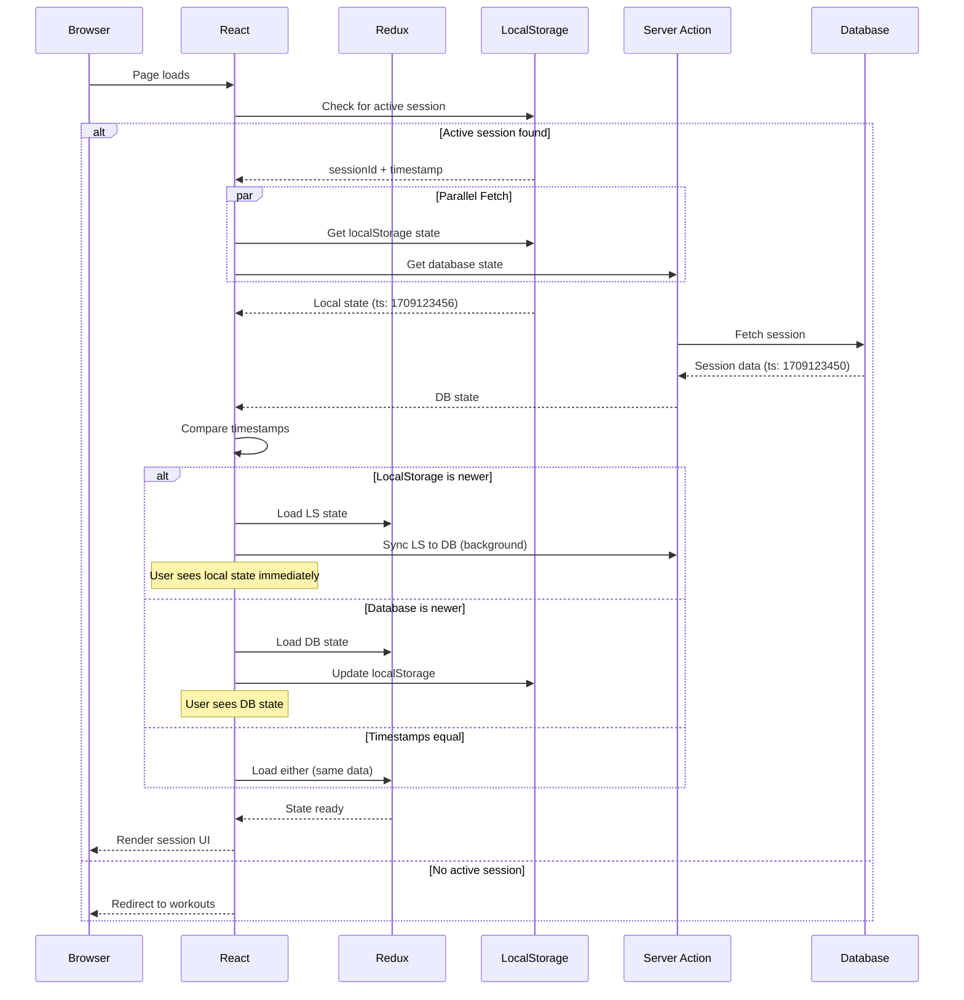

# Session Reload Persistence Strategy

## Overview

This document outlines the comprehensive strategy for persisting session state across page reloads, ensuring zero data loss during active workout sessions.

## Problem Statement

During a live workout session, users may accidentally:

- Refresh the page (F5, Ctrl+R)
- Navigate away and return
- Experience browser crashes
- Close the tab accidentally
- Lose network connection

In ALL cases, the session must recover with:

- All completed sets preserved
- Current exercise position maintained
- Unsaved input values restored
- In-progress state intact

## Architecture

### Three-Tier Persistence Model

```
┌─────────────────────────────────────────────────────────────┐
│                    User Interface (React)                    │
│                                                              │
│  ┌────────────┐  ┌────────────┐  ┌────────────────────┐   │
│  │ Set Input  │→ │ Redux      │→ │ LocalStorage       │   │
│  │ (onChange) │  │ (immediate)│  │ (debounced 300ms)  │   │
│  └────────────┘  └────────────┘  └────────────────────┘   │
│                        ↓                    ↓               │
│                   Optimistic UI         Background Sync     │
│                                                              │
└──────────────────────────────┬───────────────────────────────┘
                               │
                               ↓
                    ┌──────────────────────┐
                    │  Database (Postgres) │
                    │  - Debounced sync    │
                    │  - Batch updates     │
                    │  - 500ms delay       │
                    └──────────────────────┘
```

### Persistence Layers

| Layer            | Technology    | Update Frequency | Purpose                          |
| ---------------- | ------------- | ---------------- | -------------------------------- |
| **Redux**        | Redux Toolkit | Immediate        | UI reactivity, optimistic state  |
| **LocalStorage** | Browser API   | 300ms debounce   | Crash recovery, offline fallback |
| **Database**     | Postgres      | 500ms debounce   | Source of truth, cross-device    |

## Implementation Details

### 1. Redux State Structure

```typescript
type SessionState = {
  // Core session data
  session: TrainingSessionWithDetails | null

  // UI Navigation
  currentExerciseIndex: number
  currentExerciseInstanceId: string | null

  // Sync metadata
  lastSyncedAt: number | null // Unix timestamp
  lastLocalStorageSaveAt: number | null // Unix timestamp
  hasPendingChanges: boolean

  // Optimistic UI state (not yet saved to DB)
  pendingSets: Record<string, SessionSet> // setId -> set data

  // Loading states
  isLoading: boolean
  isSaving: boolean

  // Error handling
  error: string | null
  syncErrors: string[]
}
```

### 2. LocalStorage Schema

**Key**: `bfit_session_{sessionId}`

```typescript
type SessionBackup = {
  version: '1.0' // Schema version for migration
  sessionId: string
  timestamp: number // Unix timestamp of last save

  // Full Redux state snapshot
  state: SessionState

  // Additional recovery metadata
  metadata: {
    userAgent: string
    url: string
    lastActiveAt: number
  }
}
```

**Key**: `bfit_active_session_id`

```typescript
type ActiveSessionRef = {
  sessionId: string
  startedAt: number
}
```

### 3. Database Sync Strategy

**Debounced Batch Updates:**

- Collect state changes in a queue
- Wait 500ms after last change
- Send batch update to server action
- Handle success/failure responses

**Server Action**: `syncSessionState()`

```typescript
type SyncPayload = {
  sessionId: string
  timestamp: number
  changes: {
    completedSets?: SessionSet[]
    currentExerciseIndex?: number
    sessionNotes?: string
    exerciseNotes?: Record<string, string> // instanceId -> notes
  }
}
```

## Reload Recovery Flow

### Page Load Sequence



### Decision Logic

```typescript
function recoverSessionState(
  localState: SessionBackup | null,
  dbState: TrainingSessionWithDetails | null
): SessionState {
  // No local backup - use DB
  if (!localState && dbState) {
    return transformDBToRedux(dbState)
  }

  // No DB state - use local (shouldn't happen)
  if (localState && !dbState) {
    // Log warning - data integrity issue
    logWarning('Session in LS but not in DB')
    return localState.state
  }

  // Both exist - use newest
  if (localState && dbState) {
    const localTimestamp = localState.timestamp
    const dbTimestamp = new Date(dbState.updatedAt).getTime()

    if (localTimestamp > dbTimestamp) {
      // Local is newer - background sync to DB
      syncToDatabase(localState.state, dbState.id)
      return localState.state
    } else {
      // DB is newer or equal
      return transformDBToRedux(dbState)
    }
  }

  // Neither exists
  throw new Error('No session state found')
}
```

## Redux Middleware for Auto-Persistence

### LocalStorage Middleware

```typescript
const localStorageMiddleware: Middleware = (store) => (next) => (action) => {
  const result = next(action)

  // Only persist on session-related actions
  if (action.type.startsWith('session/')) {
    const state = store.getState().session

    // Debounce LS writes (300ms)
    debouncedSaveToLocalStorage(state)
  }

  return result
}

const debouncedSaveToLocalStorage = debounce((state: SessionState) => {
  if (!state.session) return

  const backup: SessionBackup = {
    version: '1.0',
    sessionId: state.session.id,
    timestamp: Date.now(),
    state: state,
    metadata: {
      userAgent: navigator.userAgent,
      url: window.location.href,
      lastActiveAt: Date.now(),
    },
  }

  localStorage.setItem(`bfit_session_${state.session.id}`, JSON.stringify(backup))

  // Also set active session reference
  localStorage.setItem(
    'bfit_active_session_id',
    JSON.stringify({
      sessionId: state.session.id,
      startedAt: state.session.startedAt,
    })
  )
}, 300)
```

### Database Sync Middleware

```typescript
const dbSyncMiddleware: Middleware = (store) => (next) => (action) => {
  const result = next(action)

  // Track changes that need DB sync
  const syncActions = [
    'session/completeSet',
    'session/updateSetMetrics',
    'session/addExerciseNotes',
    'session/navigateExercise',
  ]

  if (syncActions.includes(action.type)) {
    const state = store.getState().session

    // Mark as having pending changes
    store.dispatch(sessionActions.setPendingChanges(true))

    // Debounce DB sync (500ms)
    debouncedSyncToDatabase(state)
  }

  return result
}

const debouncedSyncToDatabase = debounce(async (state: SessionState) => {
  if (!state.session) return

  try {
    const result = await syncSessionState({
      sessionId: state.session.id,
      timestamp: Date.now(),
      changes: extractChanges(state),
    })

    if (result.success) {
      store.dispatch(sessionActions.markSynced(Date.now()))
      store.dispatch(sessionActions.setPendingChanges(false))
    } else {
      store.dispatch(sessionActions.addSyncError(result.error))
    }
  } catch (error) {
    console.error('DB sync failed:', error)
    store.dispatch(sessionActions.addSyncError(error.message))
  }
}, 500)
```

## Session Cleanup Strategy

### On Session Complete/Abandon

```typescript
async function cleanupSession(sessionId: string) {
  // 1. Final sync to database
  await syncSessionState({
    sessionId,
    timestamp: Date.now(),
    changes: extractFinalState(),
  })

  // 2. Clear Redux state
  dispatch(sessionActions.clearSession())

  // 3. Remove from localStorage
  localStorage.removeItem(`bfit_session_${sessionId}`)
  localStorage.removeItem('bfit_active_session_id')

  // 4. Navigate away
  router.push('/workouts')
}
```

### Orphaned Session Detection

**Background cleanup job** (runs on app start):

```typescript
async function cleanupOrphanedSessions() {
  const allSessionKeys = Object.keys(localStorage).filter((key) => key.startsWith('bfit_session_'))

  const activeSessionId = localStorage.getItem('bfit_active_session_id')

  for (const key of allSessionKeys) {
    const sessionId = key.replace('bfit_session_', '')

    // Not the active session
    if (activeSessionId && sessionId !== activeSessionId) {
      const backup = JSON.parse(localStorage.getItem(key))
      const age = Date.now() - backup.timestamp

      // Older than 24 hours - cleanup
      if (age > 24 * 60 * 60 * 1000) {
        localStorage.removeItem(key)
      }
    }
  }
}
```

## Edge Cases & Error Handling

### 1. Concurrent Tab Scenario

**Problem**: User opens session in two tabs
**Solution**:

- Detect via `storage` event listener
- Show warning toast: "Session open in another tab"
- Make current tab read-only or force sync

### 2. Network Offline During Session

**Problem**: Database sync fails
**Solution**:

- Continue saving to localStorage
- Show "Offline - changes saved locally" indicator
- Retry sync when network returns (via `online` event)
- Queue failed syncs for retry

### 3. LocalStorage Full

**Problem**: QuotaExceededError
**Solution**:

- Fallback to sessionStorage (lost on tab close, but better than nothing)
- Clean up old session backups
- Alert user to clear browser data

### 4. Database Constraint Violation

**Problem**: Duplicate set numbers, invalid data
**Solution**:

- Server validates and returns detailed error
- Show error to user
- Keep local state - don't overwrite
- Provide "Resolve Conflict" UI

### 5. Stale Session Recovery

**Problem**: User returns to session after days
**Solution**:

- Check session age on recovery
- If > 24 hours old:
  - Prompt: "Resume old session or start new?"
  - If resume: Load state but warn data may be stale
  - If new: Archive old session, start fresh

## UI Indicators

### Sync Status Display

```typescript
type SyncStatus =
  | 'synced'      // ✓ All changes saved
  | 'saving'      // ⟳ Saving...
  | 'pending'     // • Unsaved changes
  | 'offline'     // ⚠ Offline
  | 'error';      // ✕ Sync failed

// Display in header
<SyncIndicator status={syncStatus} />
```

### Recovery Toast

On page reload with recovered state:

```
✓ Session recovered
All your progress is safe!
```

## Testing Checklist

- [ ] Reload during set input - input values preserved
- [ ] Reload after completing set - set marked complete
- [ ] Reload after navigating exercises - position maintained
- [ ] Kill network during session - continues working locally
- [ ] Network returns - syncs queued changes
- [ ] Close tab mid-session - reopens at same position
- [ ] Browser crash recovery - all data intact
- [ ] Concurrent tabs - warning shown
- [ ] LocalStorage full - graceful fallback
- [ ] Very old session - prompt to resume or archive

## Performance Targets

| Metric                    | Target  | Measurement                           |
| ------------------------- | ------- | ------------------------------------- |
| LocalStorage write        | < 50ms  | Time from action to LS write complete |
| Database sync latency     | < 500ms | Server action round-trip              |
| Recovery time (reload)    | < 1s    | Page load to UI interactive           |
| State comparison overhead | < 100ms | LS vs DB timestamp check              |
| Memory footprint          | < 5MB   | Redux + LS combined                   |

---

**Document Version**: 1.0
**Last Updated**: 2026-02-01
**Implementation Phase**: Week 6 Tasks 6.2-6.6
